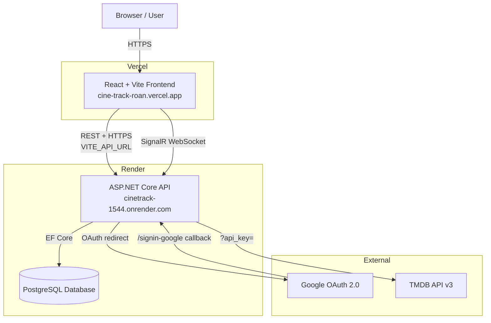
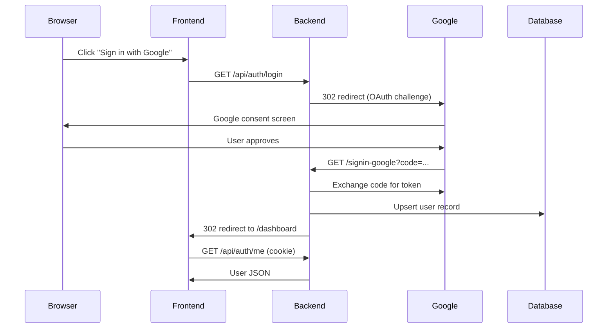
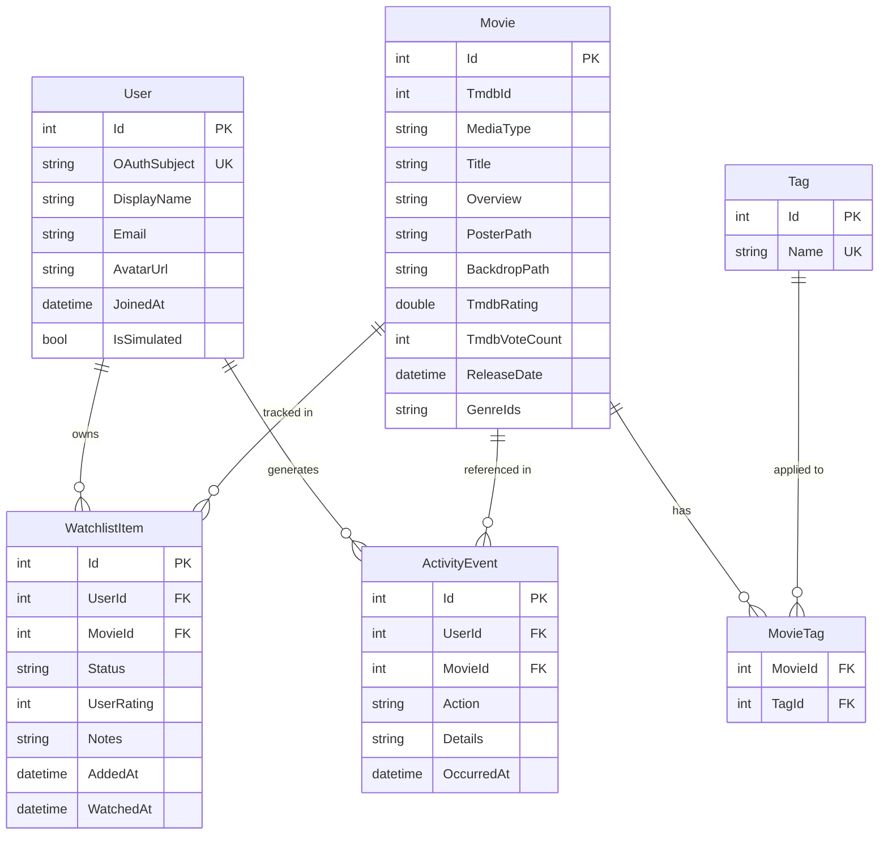

# CineTrack — Architecture Document

## System Architecture



## Authentication Flow



## Frontend Route Map

| Path | Component | Protected | Description |
|------|-----------|-----------|-------------|
| `/` | `LandingPage` | Public | Hero, trending, stats, features |
| `/browse` | `BrowsePage` | Public | Search and browse TMDB catalog |
| `/movie/:type/:id` | `MovieDetailPage` | Public | Full movie/TV detail |
| `/dashboard` | `DashboardPage` | ✅ Auth | Personal stats, recent activity |
| `/watchlist` | `WatchlistPage` | ✅ Auth | User's saved titles |
| `/watched` | `WatchedPage` | ✅ Auth | Titles marked as watched |
| `/activity` | `ActivityFeedPage` | ✅ Auth | Real-time community feed |
| `/profile` | `ProfilePage` | ✅ Auth | User profile and settings |
| `*` | `NotFoundPage` | Public | 404 fallback |

## Backend Endpoint Table

| Method | Path | Auth | Description |
|--------|------|------|-------------|
| GET | `/api/auth/login` | Public | Initiates Google OAuth flow |
| GET | `/api/auth/callback` | Public | Google OAuth callback handler |
| POST | `/api/auth/logout` | Public | Clears session cookie |
| GET | `/api/auth/me` | ✅ 401 | Returns current user profile |
| POST | `/api/auth/test-login` | Dev only | Dev-only E2E test auth bypass (404 in production) |
| GET | `/api/me` | ✅ 401 | Returns user profile with personal watchlist stats |
| GET | `/api/movies` | Public | Paginated movie/TV catalog |
| GET | `/api/movies/search` | Public | TMDB search proxy |
| GET | `/api/movies/:type/:id` | Public | Movie/TV detail (TMDB) |
| GET | `/api/me/watchlist` | ✅ 401 | Get authenticated user's watchlist |
| POST | `/api/me/watchlist` | ✅ 401 | Add title to watchlist |
| PUT | `/api/me/watchlist/:id` | ✅ 401 + 403 | Update watchlist item (own only) |
| DELETE | `/api/me/watchlist/:id` | ✅ 401 + 403 | Delete watchlist item (own only) |
| GET | `/api/stats` | Public | Platform-wide aggregate stats |
| GET | `/api/activity` | ✅ 401 | Paginated activity feed |
| POST | `/api/admin/seed` | Admin key | Seed database with TMDB data |
| GET | `/healthz` | Public | Health check for Render |

## Data Model (ERD)



## Reusable Components (13)

| Component | Responsibility |
|-----------|---------------|
| `NavBar` | Global navigation, auth state display, responsive mobile layout |
| `MovieCard` | Poster, title, rating, media type badge, watchlist button |
| `MovieGrid` | Responsive 2–6 column grid with loading/empty/error states |
| `SearchBar` | Debounced search input with clear button and `role="search"` |
| `WatchlistButton` | Add/remove from watchlist with real-time status indicator |
| `WatchlistForm` | Edit status, rating (1–10), and notes with inline validation |
| `RatingStars` | Interactive 1–10 star rating with per-star `aria-label` |
| `ProtectedRoute` | Auth guard — shows spinner while loading, redirects to `/` if unauthenticated |
| `StatusBadge` | Color-coded pill for Watchlist / Watching / Watched / Dropped |
| `LoadingSpinner` | Centered spinner with `role="status"` and `aria-label="Loading"` |
| `EmptyState` | Consistent empty-list messaging with optional CTA button |
| `ErrorBoundary` | React class component that catches render errors and shows fallback UI |
| `ActivityFeedItem` | Compact event card with user avatar, poster thumbnail, and timestamp |

## Deployment Architecture

```
GitHub (main branch)
    │
    ├── GitHub Actions CI (.github/workflows/ci.yml)
    │   ├── backend job  — dotnet restore → build → test (xUnit, 24 tests)
    │   ├── frontend job — npm ci → tsc → vite build → vitest (44 tests)
    │   ├── e2e job      — playwright install → vite build → npm run preview → playwright test
    │   │                  (42 E2E scenarios across 6 spec files, chromium only in CI)
    │   ├── deploy-frontend (continue-on-error) — Vercel action (requires VERCEL_TOKEN secret)
    │   └── deploy-backend  (continue-on-error) — Render deploy hook (requires RENDER_DEPLOY_HOOK_URL secret)
    │
    ├── Vercel (native GitHub integration auto-deploys on push to main)
    │   └── React + Vite SPA → static CDN
    │       VITE_API_URL=https://cinetrack-1544.onrender.com
    │       URL: https://cine-track-roan.vercel.app
    │
    └── Render (native GitHub integration auto-deploys kdang74/CineTrack on push to main)
        ├── Docker container (mcr.microsoft.com/dotnet/aspnet:10.0)
        │   └── ASP.NET Core Minimal API
        │       URL: https://cinetrack-1544.onrender.com
        └── PostgreSQL (Render managed, durable storage)
```

## Custom Hooks

| Hook | Location | Purpose |
|------|----------|---------|
| `useAuth` | `contexts/AuthContext.tsx` | Returns `{ user, login, logout }` — global auth state via React context |
| `usePageTitle` | `hooks/usePageTitle.ts` | Sets `document.title` to `"Page — CineTrack"` on mount, resets on unmount |

## Key Technology Choices

| Decision | Choice | Rationale |
|----------|--------|-----------|
| Frontend framework | React + Vite + TypeScript | Fast HMR, type safety, large ecosystem |
| Styling | Tailwind CSS | Utility-first, consistent dark theme without a component library overhead |
| Backend | .NET 10 Minimal APIs | Minimal boilerplate, high performance, modern C# patterns |
| ORM | Entity Framework Core (SQLite dev / PostgreSQL prod) | Code-first schema, LINQ queries, no raw SQL required |
| Auth | Google OAuth 2.0 + cookie sessions | HttpOnly cookies avoid XSS risks vs. localStorage JWTs |
| Real-time | SignalR | Built into ASP.NET Core, WebSocket fallback to long-polling |
| TMDB API | v3 (api_key query param) | Free tier, 500k requests/day, rich movie/TV metadata |
| Testing | Vitest + RTL (frontend), xUnit (backend), Playwright (E2E) | Industry-standard tooling for each layer |
| CI/CD | GitHub Actions | Native GitHub integration, free for public repos |
| Hosting | Vercel (frontend) + Render (backend + PostgreSQL) | Free tiers, automatic HTTPS, Docker support |
